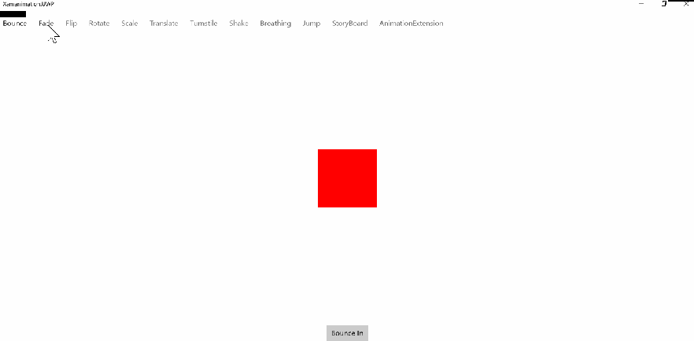

# Xamanimation - Animation Library for Xamarin.Forms

**Xamanimation** is a portable library designed for Xamarin.Forms that aims to facilitate the use of **animations** to developers. Very simple use from **C# and XAML** code.



We can define animations in XAML to a visual element when loading through a Behavior, use a trigger in XAML to execute the animation or  from C# code.

Available animations:

- Color
- FadeTo
- Flip
- Heart
- Jump
- Rotate
- Scale
- Shake
- Translate
- Turnstile

## Installation

To install Xamanimation, run the following command in the Package Manager Console.

    PM> Install-Package Xamanimation


## Animations directly from XAML

One of the main advantages of the library is the possibility of using animations from **XAML**. We must use the following namespace:

    xmlns:xamanimation="clr-namespace:Xamanimation;assembly=Xamanimation"

Let's animate a BoxView:

    <BoxView
         x:Name="FadeBox"
         HeightRequest="120"
         WidthRequest="120"
         Color="Blue" />

we can define animations directly in XAML (as Application or Page Resources):

    <xamanimation:FadeToAnimation
         x:Key="FadeToAnimation"
         Target="{x:Reference FadeBox}"
         Duration="2000"
         Opacity="0"/>

Using the namespace of xamanimation, we have access to the whole set of animations of the library. In all of them there are a number of common **parameters** such as:

- **Target**: Indicate the visual element to which we will apply the animation.
- **Duration**: Duration of the animation in milliseconds.

Depending on the animation type used, we will have more parameters to customize the specific animation. For example, in the case of Fade Animation we will have an Opacity property to set how we modify the opacity.

To launch the animation we have two options:

- **Trigger**: Called BeginAnimation that allows us to launch an animation when a condition occurs.
- **Behavior**: We have a Behavior called BeginAnimation that we can associate to a visual element so that indicating the desired animation, we can launch the same when the element load occurs.

Using the Clicked event of a button we can launch the previous animation using the trigger provided:

    <Button 
         Text="Fade">
         <Button.Triggers>
              <EventTrigger Event="Clicked">
                   <xamanimation:BeginAnimation
                        Animation="{StaticResource FadeToAnimation}" />
              </EventTrigger>
         </Button.Triggers>
    </Button>

We also have the concept of **Storyboard** as a set of animations that we can execute over time:

    <xamanimation:StoryBoard
         x:Key="StoryBoard"
         Target="{x:Reference StoryBoardBox}">
         <xamanimation:ScaleToAnimation  Scale="2"/>
         <xamanimation:ShakeAnimation />
    </xamanimation:StoryBoard>

## Using C# 

In the same way that we can use the animations of the library from XAML, we can do it from **C#** code. We have an extension method called **Animate** that expects an instance of any of the available animations.

If we want to animate a BoxView called AnimationBox:

    <BoxView
         x:Name="AnimationBox"
         HeightRequest="120"
         WidthRequest="120"
         Color="Blue" />

Access the element, use the Animate method with the desired animation:

    AnimationBox.Animate(new HeartAnimation());

## Triggers!

Triggers allow you to start animations declaratively in XAML based on events or property changes.

```
<Entry 
    FontSize="16" 
    BackgroundColor="LightGray">
    <Entry.Triggers>
        <Trigger TargetType="Entry" Property="IsFocused" Value="True">
            <Trigger.EnterActions>
                <xamanimation:AnimateDouble TargetProperty="Entry.FontSize" To="24"/>
                <xamanimation:AnimateColor TargetProperty="Entry.TextColor" To="Red"/>
                <xamanimation:AnimateColor TargetProperty="VisualElement.BackgroundColor" To="Yellow" Delay="1000"/>
                <xamanimation:AnimateDouble TargetProperty="VisualElement.Rotation" To="12" Duration="100"/>
            </Trigger.EnterActions>
            <Trigger.ExitActions>
                <xamanimation:AnimateDouble TargetProperty="{x:Static Entry.FontSizeProperty}" To="16"/>
                <xamanimation:AnimateColor TargetProperty="{x:Static Entry.TextColorProperty}" To="Black"/>
                <xamanimation:AnimateColor TargetProperty="{x:Static VisualElement.BackgroundColorProperty}" To="LightGray"/>
                <xamanimation:AnimateDouble TargetProperty="{x:Static VisualElement.RotationProperty}" To="0"/>
            </Trigger.ExitActions>
        </Trigger>
    </Entry.Triggers>
</Entry>
```


You can animate any property of type Int, Double, Color, Thickness or CornerRadius. Available options:
* AnimateInt
* AnimateColor
* AnimateCornerRadius
* AnimateDouble
* AnimateThickness

## Progress Animations

Sometimes you need to animate something based on a value that changes over time, for example as a a the result of a user interaction.

A common scenario is using a scroll. A parallax effect, etc.

```
<BoxView 
    BackgroundColor="Red"
    CornerRadius="24, 24, 0, 0">
    <VisualElement.Behaviors>
        <xamanimation:AnimateProgressColor
            TargetProperty="VisualElement.BackgroundColor"
            Progress="{Binding ScrollY, Source={x:Reference ScrollBehavior}}" 
            Minimum="0"
            Maximum="200"
            From="Black"
            To="Red"/>
        <xamanimation:AnimateProgressCornerRadius
            TargetProperty="BoxView.CornerRadius"
            Progress="{Binding ScrollY, Source={x:Reference ScrollBehavior}}" 
            Minimum="0"
            Maximum="200"
            From="24, 24, 0, 0"
            To="0,0,0,0"/>
    </VisualElement.Behaviors>
</BoxView>
```


Available options:
* AnimateProgressInt
* AnimateProgressColor
* AnimateProgressCornerRadius
* AnimateProgressDouble
* AnimateProgressThickness

## Transitions

Provides the animated transition behavior on controls when they first appear. You can use this on individual objects or on containers of objects. In the latter case, child elements will animate into view in sequence rather than all at the same time.

```
<FlexLayout 
     Wrap="Wrap"
	 Direction="Row"
	 JustifyContent="Start"
	 AlignItems="Start"
	 AlignContent="Start">
	 <FlexLayout.Behaviors>
	 <xamanimation:EntranceTransition
	      Duration="1000"/>
	 </FlexLayout.Behaviors>
</FlexLayout>
```


## Feedback

Please use [GitHub issues](https://github.com/jsuarezruiz/xamanimation/issues) for questions or comments.

## Copyright and license

Code released under the [MIT license](https://opensource.org/licenses/MIT).
